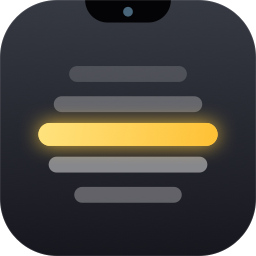
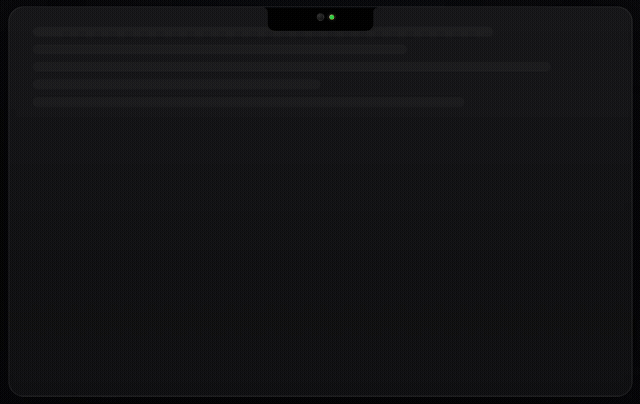

<p align="center">
  
</p>

<h1 align="center">DynoPrompt</h1>

<p align="center">
  <strong>A free teleprompter for Mac, iPhone, and iPad.</strong>
</p>

<p align="center">
  Built for streamers, interviewers, presenters, and podcasters.
</p>

<p align="center">
  <a href="#install">Install</a> · <a href="#ios-26-companion">iPhone &amp; iPad</a> · <a href="#features">Features</a> · <a href="#how-it-works">How It Works</a> · <a href="#building-from-source">Build</a> · <a href="#privacy-model">Privacy</a>
</p>

<p align="center">
  
</p>

---

## What is DynoPrompt?

DynoPrompt is a free, open-source, **privacy-first** teleprompter that guides you through your script with three modes: **word tracking** (follows what you actually say and advances the script), **classic** (constant-speed auto-scroll), and **voice-activated** (scrolls while you speak, pauses when you're silent). The Mac app displays your text in a sleek **Dynamic Island-style overlay** beside the camera, a **draggable floating window**, or **fullscreen on a Sidecar iPad**. The iPhone and iPad app adds near-camera reading and presenter-only camera recording.

Paste your script, hit play, and start speaking. When you're done, the overlay closes automatically.

**Speech recognition runs entirely on your Mac** — Apple's on-device recognizer by default, or a local whisper.cpp model. No microphone audio, transcript or script ever leaves the machine, and DynoPrompt refuses to start word tracking if it cannot keep that promise. See [Privacy model](#privacy-model).

Word tracking follows *meaning*, not exact text. Say "Today we're going to talk about AI and how it's changing software engineering" while your script reads "Today we're going to discuss artificial intelligence and its impact on software engineering", and the prompter keeps pace. See [Script Synchronization](#script-synchronization).

## Status

**DynoPrompt is not published.** There is no App Store listing, no signed
release and no Homebrew formula — you build it yourself, which takes one
command. See [Install](#install).

Requires **macOS 15 Sequoia** or later. Works on Apple Silicon and Intel.

> Looking for a released, notarised teleprompter you can just download?
> Use **[Textream](https://apps.apple.com/app/textream/id6800061488)** by
> [Fatih Kadir Akın](https://github.com/f) — the excellent project DynoPrompt
> is built on. It's on the App Store and Homebrew, and it's the right choice
> if you don't want to build from source.
>
> DynoPrompt exists to take that further in one direction: making speech
> recognition run entirely on your machine.

## Install

Build it once and it lives in `/Applications` like any other app — no Xcode
needed afterwards.

```bash
git clone https://github.com/abhi-ramtel/dynoprompt.git
cd dynoprompt/DynoPrompt
brew install cmake          # needed once, to compile the bundled speech engine
./Scripts/install.sh
```

That builds Release, signs the app and its speech helper, and installs to
`/Applications/DynoPrompt.app`. Then just `open -a DynoPrompt`.

The first build takes several minutes: it compiles whisper.cpp and downloads
the speech model so the finished app needs neither. Later builds skip both.

| | |
|---|---|
| Install elsewhere | `./Scripts/install.sh ~/Applications` |
| Update after changes | re-run `./Scripts/install.sh` |
| Check the speech stack | `/Applications/DynoPrompt.app/Contents/MacOS/DynoPrompt --whisper-selftest` |
| Uninstall | `rm -rf /Applications/DynoPrompt.app` |

**Signing.** Without a paid Apple Developer account the app is signed ad-hoc,
which is fine on a Mac you build on yourself. The one wrinkle: macOS ties
microphone permission to the code signature, and an ad-hoc signature changes
with every build — so a reinstall may ask for microphone access again. If you
have a Developer ID, use it and that stops:

```bash
DEVELOPER_ID="Developer ID Application: Your Name (TEAMID)" ./Scripts/install.sh
```

Run `security find-identity -v -p codesigning` to see what you have.

On first launch macOS asks for microphone access, and for speech recognition if
you use the Apple engine. Both are needed for word tracking, and everything is
processed on your Mac.

## iOS 26 Companion

DynoPrompt carries the iOS companion inherited from Textream. It builds from
this repository, but it is unpublished and has had far less attention than the
Mac app — the local speech work described below is macOS only.

- **Portrait and landscape** — A fullscreen teleprompter layout adapts to both orientations.
- **Mirror mode for teleprompter glass** — Read mode can flip the prompt horizontally, vertically, or on both axes whenever the device is in landscape. The prompt controls stay readable, and a compact ↔ button opens live mirror, position, text-size, speed, and playback-control settings.
- **Eye-contact reading position** — The active line sits just below the front camera by default, or can be centered in Prompter Settings.
- **The same three guidance modes** — Word Tracking, Classic auto-scroll, and Voice-Activated scrolling use the same behavior as the Mac app.
- **Optional camera while reading** — Read mode works as a distraction-free teleprompter, or you can show and hide the camera behind the prompt.
- **Selfie video recording** — Record mode captures camera video and microphone audio, starts with the front camera, and lets you switch between front and back cameras before recording.
- **Saved to Photos** — Completed recordings are added to Photos and appear in an adaptive DynoPrompt recordings gallery, where you can play, select, and delete them. If a save fails, DynoPrompt keeps a pending local copy and offers retry or discard controls in the current or next Record session.
- **Presenter-only prompt** — The translucent scrolling prompt is visible on screen while you record, but it is not burned into the saved video.
- **Matching fonts** — Sans, Serif, Mono, and OpenDyslexic are available on both platforms.
- **Liquid Glass** — Controls use the native iOS 26 Liquid Glass appearance.

## Features

### Guidance Modes

| Mode | Description | Microphone |
|---|---|---|
| **Word Tracking** (default) | Local speech recognition follows what you actually say and advances the script. Runs entirely on this Mac. | Required |
| **Classic** | Auto-scrolls at a constant speed. No microphone needed. | Not needed |
| **Voice-Activated** | Scrolls while you speak, pauses when you're silent or muted. Perfect for natural pacing. | Required |

- **Scroll speed** — Adjustable 0.5–8 words/s for Classic and Voice-Activated modes.
- **Speech language** — Choose your preferred speech recognition language for Word Tracking mode.
- **Mouse scroll to catch up** — In Classic and Voice-Activated modes, scroll with your mouse to jump ahead or back. The timer pauses while you scroll and resumes from the new position.

### Overlay Modes

| Mode | Description |
|---|---|
| **Pinned to Notch** | A Dynamic Island–shaped overlay anchored below the MacBook notch. Sits above all apps. |
| **Floating Window** | A draggable window you can place anywhere on screen. Always on top. |
| **Fullscreen** | Fullscreen teleprompter on any display. Press **Esc** to stop. |

#### Pinned to Notch options

- **Follow Mouse** — The notch moves to whichever display your cursor is on.
- **Fixed Display** — Pin the notch to a specific screen.

#### Floating Window options

- **Follow Cursor** — The window follows your mouse cursor. A floating stop button lets you dismiss it.
- **Glass Effect** — Translucent frosted glass background with adjustable opacity (0–60%).

#### Fullscreen options

- **Display selection** — Choose which screen to show the fullscreen teleprompter on.
- **Esc to stop** — Press the Escape key to dismiss the fullscreen overlay.

### Size & Text

Every dimension is a **continuous value you can type exactly**, not a preset.
The right size depends on how far you sit from the screen, which is a property
of your room — so nothing here is fixed.

| Setting | Range | Default |
|---|---|---|
| **Width** | 240 – 1600 px | 340 px |
| **Height** | 80 – 1000 px | 150 px |
| **Font size** | 10 – 96 pt | 20 pt |
| **Line spacing** | 0.8× – 3.0× | 1.4× |
| **Opacity** | 20 – 100% | — |

Each has a slider *and* a number field with a stepper: sliders are good for
finding a value and bad for reproducing one, so a size that reads correctly
from your chair can be typed back exactly on another machine.

**Fit Width** snaps the overlay to the current display. A size larger than the
screen is allowed — you may move to a bigger display — and the overlay fits
itself to whatever screen it is actually on, with a note in Settings when that
is happening.

Font size keeps its XS/SM/LG/XL buttons as quick picks; they just write into
the continuous value.

### Font & Color

| Setting | Options |
|---|---|
| **Font Family** | Sans, Serif, Mono, OpenDyslexic (dyslexia-friendly) |
| **Font Size** | XS (14 pt), SM (16 pt), LG (20 pt), XL (24 pt) |
| **Highlight Color** | White, Yellow, Green, Blue, Pink, Orange |

### External Display & Sidecar

| Mode | Description |
|---|---|
| **Off** | No external display output. |
| **Teleprompter** | Fullscreen teleprompter on the selected external display or Sidecar iPad. |
| **Mirror** | Flipped output for prompter mirror rigs. |

- **Mirror axis** — Horizontal (standard for mirrors), Vertical, or Both (180° rotation).
- **Target display** — Pick from connected external displays and Sidecar iPads.
- **Hide from screen share** — Hides the overlay from screen recordings and video calls.

### Remote Connection

View your teleprompter on **any device** — phone, tablet, or another computer — via a local network browser connection.

- **Enable in Settings → Remote** — Starts a lightweight HTTP + WebSocket server on your Mac.
- **QR code** — Scan the generated QR code from your phone or tablet to open the teleprompter instantly.
- **Real-time sync** — Words highlight, waveform animates, and progress updates in real time over WebSocket.
- **Mirror mode (per device)** — Tap **Mirror** in the remote view to flip the prompt horizontally for teleprompter glass. The choice is remembered on that device, and `?mirror=1` or `?mirror=0` in the URL presets it.
- **No app needed** — Works in any modern browser. No installation required on the remote device.
- **Configurable port** — Default port 7373, adjustable in advanced settings.
- **Authenticated** — Each session generates a token that the page presents before receiving any data. Browsers from other origins are refused at the WebSocket handshake, and requests arriving under a foreign hostname are rejected, so a website you happen to have open cannot read your script or live transcript.
- **Direct local connection** — DynoPrompt does not relay Remote Connection traffic through a developer server. Traffic is unencrypted HTTP: enable it only on a local network and with devices you trust.

### Director Mode

Let someone else control your teleprompter remotely. A director can write, edit, and push scripts to your teleprompter in real time from any browser.

- **Enable in Settings → Director** — Starts a dedicated HTTP + WebSocket server (default port 7575).
- **Remote web UI** — The director opens a mobile-friendly web page with a full-featured script editor.
- **Live text editing** — The director types or pastes a script, hits Go, and your teleprompter starts immediately with word tracking.
- **Read-locked highlighting** — Already-read text is highlighted and locked in the web editor. Only unread text remains editable.
- **Real-time sync** — Word progress, waveform, mic status, and audio levels stream to the director's browser at 10 Hz.
- **Single-page mode** — Director mode works with a single page of text. Multi-page scripts are not used.
- **Editor disabled** — When director mode is active, the macOS editor is replaced with a QR code overlay so the director has full control.
- **QR code** — Scan or share the QR code from Settings or the editor overlay to connect the director instantly.

### File Support

- **PowerPoint notes import** — Drop a .pptx file to extract presenter notes as pages. For Keynote or Google Slides, export to PowerPoint first.
- **Save as .dynoprompt files** — Save your scripts as .dynoprompt files to reuse anytime. Keep your notes organized across presentations.
- **Multi-page support** — Navigate between pages with automatic advance. In follow-cursor mode, pages auto-advance with a 3-second countdown.

### Other

- **Live waveform** — Visual voice activity indicator so you always know the mic is picking you up.
- **Tap to jump** — Tap any word in the overlay to jump the tracker to that position.
- **Pause & resume** — Go off-script, take a break, come back. The tracker picks up where you left off.
- **Mute / unmute** — Toggle the microphone on or off from the overlay in any mode.
- **Private by design** — No accounts, ads, analytics, or DynoPrompt-operated cloud service. Speech recognition runs **on this Mac by default** and DynoPrompt refuses to start Word Tracking if it cannot. See [Privacy model](#privacy-model).
- **Auto update checker** — Checks GitHub Releases for new versions on launch and from the DynoPrompt menu.
- **Open source** — MIT licensed. Contributions welcome.

### Script Library

Scripts are saved on this Mac and never leave it.

| Action | How |
|---|---|
| Open the library | **⌘L**, or File → Script Library… |
| Save the current script | **⌥⌘S**, or File → Save to Library |
| Create a new script | **New** in the library sheet |
| Rename / duplicate / delete | Right-click a script in the library |

Each script keeps its pages, word count, estimated read time, and last-edited
date. Files live in `~/Library/Application Support/DynoPrompt/Scripts` as one
JSON file per script, created owner-only (`0700` directory, `0600` files).

`.dynoprompt` file save/open and PowerPoint notes import continue to work
unchanged alongside the library.

### Keyboard Shortcuts

While the teleprompter is running, you shouldn't need to touch the UI:

| Key | Action |
|---|---|
| **Esc** | Stop the prompter |
| **Space** | Pause / resume |
| **M** | Mute / unmute the microphone |
| **→** / **←** | Forward / back one word |
| **⌥→** / **⌥←** | Forward / back one sentence |
| **R** | Reset to the start |
| **+** / **−** | Increase / decrease font size |
| **]** / **[** | Increase / decrease opacity |
| **⇧→** / **⇧←** | Widen / narrow the overlay |
| **⇧↑** / **⇧↓** | Taller / shorter overlay |
| **Tab** | Next page |

Font size and the overlay dimensions can all be dialled in **mid-session**, on
camera, without opening Settings.

Manual moves always override speech tracking — if you say you're somewhere,
you're there. Shortcuts carrying ⌘ or ⌃ are passed through untouched, so ⌘Q and
friends keep working while the overlay is up.

In the editor: **⌘↩** start, **⌘L** library, **⌘O** open file, **⌘S** save
file, **⌥⌘S** save to library, **⌘,** settings.

## Speech Recognition

DynoPrompt ships two local engines, selectable in **Settings → Guidance →
Speech Engine**.

| Engine | Runtime | Latency | Notes |
|---|---|---|---|
| **Apple (On-Device)** (default) | `SFSpeechRecognizer`, pinned to on-device | Lowest — streams continuously | Needs an on-device model for your language |
| **Whisper (Local)** | Built-in whisper.cpp in a sandboxed XPC helper | ~0.1 s per window | **Nothing to install.** Works even in a sandboxed build. Better with accents and jargon |

Whisper is **bundled**: `ggml-base.en` ships inside the app, so there is no
download, no Homebrew formula and no external process to install. On an M-series
Mac it transcribes a ~5-second window in about **0.1 s** (roughly 50× realtime).

### Apple (On-Device)

DynoPrompt sets `requiresOnDeviceRecognition = true` on every recognition
request. This is the default and it is deliberate: left unset, macOS is free to
stream microphone audio to Apple for transcription, and a teleprompter holds
the microphone open for an entire session.

If your chosen language has no on-device model installed, DynoPrompt tells you in
Settings and **refuses to run** rather than silently falling back to the cloud.
Install the model in **System Settings → General → Language & Region**, pick
another language, or switch to the Whisper engine.

The **Keep audio on this Mac** toggle can be turned off if you knowingly want
cloud recognition. Doing so shows a warning, and it is the only way audio ever
leaves the machine.

### Whisper (Local)

whisper.cpp is **linked directly into a sandboxed XPC service** that ships
inside the app, together with the `ggml-base.en` model. Nothing is installed,
downloaded or spawned at runtime.

```
DynoPrompt.app/
└── Contents/
    └── XPCServices/
        └── WhisperService.xpc          ← whisper.cpp, statically linked
            └── Contents/Resources/models/
                └── ggml-base.en.bin    ← 141 MB, shipped
```

**Why an XPC service and not a subprocess:**

| | Subprocess + loopback HTTP | Embedded XPC service |
|---|---|---|
| Works in a sandboxed build | No — the sandbox forbids launching a helper | **Yes** — a sandboxed app may launch a service from its own bundle |
| Network surface | A TCP port on loopback | **None.** XPC is kernel-mediated IPC |
| Needs an install | Yes | **No** |
| Crash isolation | Yes | Yes — the prompter survives, reconnects |

The helper's own entitlements grant it **no network access of any kind**, so
even a compromised whisper.cpp could not transmit audio. The model lives inside
the *service* bundle rather than the app's Resources because a sandboxed XPC
service may read its own bundle but not its host's — a distinction that only
shows up in a signed, sandboxed build.

**Model choice.** `base.en` is the deliberate default: the synchronizer only
needs to recognize *roughly* what you said, so latency matters far more than
transcription polish. Larger models can be selected in Settings if you have
them.

**Fallback.** If the app was built without the embedded helper (you skipped
`Scripts/vendor-whisper.sh`), the Whisper engine falls back to spawning an
external `whisper-server` bound to `127.0.0.1` on an ephemeral port, with
proxies disabled on the client so a system proxy cannot reroute audio.

**Supported models** — any GGML `ggml-*.bin` whisper model. The built-in
`base.en` is used unless you pick another. DynoPrompt also looks in, in order:

```
~/Library/Application Support/DynoPrompt/models/
~/.cache/openwhispr/whisper-models/          # OpenWhispr's cache
~/Library/Application Support/open-whispr/models/
~/.cache/whisper/
```

**Supported runtimes** — DynoPrompt looks for a whisper.cpp server binary in:

1. Its own bundle
2. A path you pick in Settings
3. `OpenWhispr.app/Contents/Resources/bin/whisper-server-darwin-*`
4. `/opt/homebrew/bin` or `/usr/local/bin` (`brew install whisper-cpp`)

Smaller models are faster; DynoPrompt defaults to the smallest one it finds,
because a teleprompter needs latency more than transcription polish.

> The Whisper engine needs to launch a helper process, which the sandboxed
> **sandboxed build cannot do**. Use the Apple engine there, or the
> direct-download build for Whisper.

### Model library

**You choose the model.** DynoPrompt ships with `base.en` so it works out of
the box, but Settings → Guidance → **Manage Models…** lists nine whisper models
you can install, switch between and delete.

| | Size | Languages | Speed | Memory |
|---|---|---|---|---|
| **Tiny** / Tiny (English) | 74 MB | 99 / English | ~32× | ~390 MB |
| **Base** / Base (English) | 141 MB | 99 / English | ~16× | ~500 MB |
| **Small** / Small (English) | 465 MB | 99 / English | ~6× | ~1 GB |
| **Medium** / Medium (English) | 1.4 GB | 99 / English | ~2× | ~2.6 GB |
| **Large v3 Turbo** | 1.5 GB | 99 | ~4× | ~1.8 GB |

Speed is relative to the largest model. English-only variants are more accurate
than their multilingual counterparts at the same size, if English is all you
need.

For each model the library shows its size, language coverage, relative speed,
approximate memory, whether it is installed, and which one is active. Downloads
show live progress and can be cancelled and resumed. Everything is stored at:

```
~/Library/Application Support/DynoPrompt/Models/
```

with a **Reveal** button so you can always find it.

**Nothing downloads by itself.** Opening the library makes no network request —
the catalog is compiled into the app. A download starts only when you press
Download, and only after a dialog spells out the disk cost, the memory cost,
where the file will be saved, and that the model runs locally. If a model is
large relative to your Mac's RAM, that's called out before you commit.

#### How downloaded models are kept safe

A downloaded model is an untrusted external file, and it is handled like one.

| Control | What it does |
|---|---|
| HTTPS + host allowlist | Sources must be HTTPS on a known host. **Re-checked on every redirect** — a redirect off the allowlist aborts the transfer |
| Pinned SHA-256 | Every catalog entry carries an exact digest, verified by streaming the file so a 1.5 GB model is never held in memory |
| Size check first | A truncated transfer is rejected before the digest is trusted |
| Atomic install | Download → verify → *then* move into place. A partial file can never look installed |
| Safe staging | Written to the app's own temporary directory, never a world-writable one |
| Names from the catalog | Filenames come from the validated model id, never from `Content-Disposition` or a redirect target |
| No execution, ever | Models are data. Installed `0600`, never executable, never passed to a process launcher |
| Sandboxed parsing | whisper.cpp parses the file inside the XPC helper, which has **no network entitlement and no file access** |

On the format: **GGML/GGUF is a plain binary tensor container with no embedded
code**, unlike PyTorch `.pt`/pickle checkpoints, which can execute arbitrary
code on load. That rules out deserialization RCE by construction. What it does
not rule out is a memory-safety bug in the C++ parser — ggml has had such CVEs.
Two things contain that: the pinned digest means an attacker cannot substitute
a crafted file in the first place, and if one somehow reached the parser, it
would run in a sandboxed helper that can reach neither the network nor your
documents.

The allowlist bounds *where bytes may come from*; the digest is what makes them
trustworthy. A file that hashes correctly is the file we intended regardless of
which mirror served it, and one that does not is discarded no matter how
reputable the host.

### OpenWhispr integration

**DynoPrompt does not drive OpenWhispr, and does not require it.**

OpenWhispr is an Electron app with no public API, no documented IPC surface,
and no supported way to request a transcription from outside. Automating it
would mean binding to private internals that can change in any release, so
DynoPrompt doesn't.

What OpenWhispr *does* provide is the **same underlying technology**: it ships
whisper.cpp's `server` binary and downloads standard GGML models to a
predictable cache directory. Both are upstream artifacts in documented formats.

**DynoPrompt does not need OpenWhispr, or any separate download.** It bundles
its own whisper.cpp build and model inside the app:

```
DynoPrompt.app/Contents/XPCServices/WhisperService.xpc
  ├── MacOS/WhisperService          ← whisper.cpp, statically linked, universal
  └── Contents/Resources/models/
      └── ggml-base.en.bin          ← 141 MB, shipped
```

Nothing is fetched at first launch and there is no linkage to OpenWhispr at
all. What the discovery layer still does is let you
**reuse a model you already downloaded** — if you have OpenWhispr's
`ggml-large-v3-turbo.bin` sitting in `~/.cache/openwhispr/whisper-models`, it
appears in the model picker and you can select it instead of re-downloading
1.6 GB.

In short: **the same local speech-recognition technology, integrated
independently**, with your existing models reused rather than duplicated.
Settings shows which model and runtime are in use.

### Adding another engine

Engines implement `SpeechRecognitionProvider`:

```
Microphone
    ↓
SpeechRecognitionProvider ─┬─ Apple on-device (SFSpeechRecognizer, pinned local)
                           ├─ WhisperLocalProvider ─┬─ embedded XPC helper
                           │                        └─ external whisper.cpp server
                           └─ your provider here
    ↓
partial / final transcript
    ↓
ScriptSyncEngine
    ↓
teleprompter position
```

Nothing below the provider knows which engine produced the transcript, and
nothing above it knows how the position was derived. Swapping the speech model
— or the whole engine — does not touch the synchronizer, and the synchronizer's
102 tests run without any model installed.

The contract that matters is `isLocalOnly`: a provider must report truthfully
whether audio can leave the machine, and the app refuses to start a session
with a non-local provider unless the user has explicitly allowed it.

## Script Synchronization

Speech never matches the script word for word. This script:

> Today we're going to discuss artificial intelligence and its impact on
> software engineering.

and this delivery:

> Today we're going to talk about AI and how it is changing software
> engineering.

are the same moment in the talk, and DynoPrompt treats them that way.

**How it works** (`DynoPromptCore/ScriptSyncEngine.swift`):

1. **Normalize** — lowercase, fold diacritics, strip punctuation and
   apostrophes, so `don't` and `dont` are one token.
2. **Drop fillers** — `um`, `uh`, `you know`, `I mean`, `sort of` are removed
   from *speech* only. If the author wrote "like", it is meant to be read.
3. **Canonicalize equivalences** — `artificial intelligence` ↔ `AI`,
   `machine learning` ↔ `ML`, `five` ↔ `5`. Both sides collapse to one key, so
   a swapped initialism costs nothing.
4. **Align** — a Smith-Waterman local alignment of the recent speech window
   against a bounded slice of the script. Being *local* rather than global is
   what absorbs restarts, dropped words and improvised asides.
5. **Score** — confidence is the F1 of precision (how much of the script region
   was actually said) and recall (how much of the speech the script explains).
   That rejects a couple of accidental word hits buried in an off-script
   ramble, while still accepting an honest paraphrase.
6. **Gate** — see below.

**Stability rules**, because a prompter that lurches is worse than one that
lags:

- Never moves backwards on its own. Only you can go back.
- Below ~0.45 confidence, it holds position.
- A jump beyond 18 tokens needs high confidence **and** the same landing spot
  on two consecutive updates.
- After 4 consecutive misses, the search window widens so it can re-acquire
  after you skip a section.
- Stage directions in `[brackets]` are skipped automatically.

The work per update is bounded by the window sizes, not by script length:
**~0.15 ms per update on a 4,000-word script**, with no model inference and no
network call. There is no LLM anywhere in this path.

## Privacy model

```
Microphone
    ↓
Local speech recognition
    ├── Apple on-device (requiresOnDeviceRecognition = true), or
    └── bundled whisper.cpp in a sandboxed XPC helper with no network access
    ↓
Local synchronization engine
    ↓
Local teleprompter overlay
```

By default, **no microphone audio, transcript, script, or document leaves this
Mac.** There is no DynoPrompt server, no account, no analytics, and no telemetry.

Every network capability in the app, and why it exists:

| Component | Network use | Default | Notes |
|---|---|---|---|
| Speech recognition | **None** | — | Apple on-device, or the bundled helper, which has no network entitlement at all |
| Script library | **None** | — | Local files |
| Remote Connection | Serves a page on your LAN | **Off** | You turn it on; token-authenticated |
| Director Mode | Serves a page on your LAN | **Off** | You turn it on; token-authenticated |
| Model download | The model file you asked for | **Off** — never automatic | Only when you press Download, from an allowlisted host, verified against a pinned hash |
| Update check | `api.github.com` on launch | Off unless configured | Version string only; no identifiers |
| Apple recognition with on-device turned **off** | Audio to Apple | Off | Opt-in only, with a visible warning |

Recordings are never made or stored by the macOS app: it prompts, it does not
capture.

## Security model

DynoPrompt has **no package-manager dependencies** — no SwiftPM, CocoaPods,
Carthage or npm. The only third-party code is **whisper.cpp**, vendored
deliberately: fetched at a pinned tag by `Scripts/vendor-whisper.sh`, built
from source locally, and never committed. The model is pinned by SHA-256 in
`Scripts/fetch-model.sh` and verified on every fetch. Everything else is
Apple's SDKs plus the code in this repository.

**Trust boundaries**

| Boundary | Controls |
|---|---|
| Browser / LAN → app | Token auth, `Origin` allow-list at the WebSocket handshake, `Host` validation, connection caps, request size limits |
| Untrusted file → app | Symlink and traversal rejection on extracted archive parts, archive and part size caps, XXE disabled |
| Web page → app (URL scheme) | `dynoprompt://read?text=` is length-capped |
| App → OS | `Process` is used only for the whisper.cpp helper, with array arguments and no shell |
| App → local model | XPC to a sandboxed helper with **no network entitlement**; no socket, no port. The external-server fallback is bound to `127.0.0.1` with proxies disabled |

**If you enable Remote Connection or Director Mode**, understand what you are
turning on: both serve over plain HTTP on your local network. They are
token-authenticated and reject cross-origin browsers and rebinding attempts,
but the traffic is not encrypted. Use them on networks you trust, and never
forward those ports to the internet.

Report vulnerabilities per [SECURITY.md](SECURITY.md).

## Who it's for

| Use case | How DynoPrompt helps |
|---|---|
| **Streamers** | Read sponsor segments, announcements, and talking points without looking away from the camera. |
| **Interviewers** | Keep your questions visible while maintaining natural eye contact with your guest. |
| **Presenters** | Deliver keynotes, demos, and talks with confidence. Never lose your place. |
| **Podcasters** | Follow show notes, ad reads, and topic outlines hands-free while recording. |

## How It Works

1. **Paste your script** — Drop your talking points, interview questions, or full script into the text editor.
2. **Hit play** — The Dynamic Island overlay slides down from the top of your screen.
3. **Start speaking** — Words highlight in real-time as you read. When you finish, the overlay closes automatically.

### Recording workflow

The overlay sits directly under the notch, next to the camera, so your eyes
stay near the lens instead of dropping to a script below the screen.

1. Open DynoPrompt.
2. Press **⌘L** and pick a script, or paste a new one and press **⌥⌘S** to save it.
3. Check **Settings → Guidance**: Word Tracking mode, and an engine that
   reports it runs on this Mac.
4. Press **⌘↩**. The overlay appears under the notch; the editor window hides.
5. Drag it, or set a fixed position in **Settings → Teleprompter**. Turn on
   **Hide from screen share** so it stays out of your recording.
6. Start recording in your own camera or streaming software.
7. Speak naturally. Paraphrase freely — the script follows you.
8. Use **Space**, **→**, **⌥←** if you need to correct position, without
   touching the mouse.
9. Press **Esc** when you're done.

DynoPrompt never records anything itself. It prompts; your recording software
records.

## Building from Source

### Requirements

For the macOS app:

- macOS 15+
- Xcode 16+

For the iOS companion:

- Xcode 26+
- The iOS 26 SDK and an installed iOS 26 Simulator runtime
- A physical iPhone or iPad to verify camera, microphone, recording, and Photos saving; Simulator can verify the interface and orientation layouts but does not provide camera recording hardware

The macOS target uses Swift 5 language mode. The new iOS target uses Swift 6 with complete concurrency checking.

### Build

```bash
git clone https://github.com/f/textream.git
cd dynoprompt/DynoPrompt
open DynoPrompt.xcodeproj
```

Choose the **DynoPrompt** scheme for macOS or **DynoPromptiOS** for iOS, select a compatible destination, then build and run with ⌘R in Xcode. The **DynoPromptiOS** scheme also includes the iOS unit tests.

### Running from a clean checkout

```bash
git clone <your-repo-url> dynoprompt
cd dynoprompt/DynoPrompt
xcodebuild build -scheme DynoPrompt -destination 'platform=macOS' CODE_SIGNING_ALLOWED=NO
```

To launch the built app:

```bash
open "$(xcodebuild -scheme DynoPrompt -destination 'platform=macOS' -showBuildSettings 2>/dev/null | awk -F' = ' '/ BUILT_PRODUCTS_DIR/ {print $2}' | head -1)/DynoPrompt.app"
```

Grant microphone and speech-recognition permission on first launch. No model
download is required for the default Apple on-device engine.

#### The first build is slower, on purpose

Two build phases run automatically so the shipped app needs no downloads:

| Phase | What it does | First run | After |
|---|---|---|---|
| `Scripts/vendor-whisper.sh` | Fetches whisper.cpp at a pinned tag and builds universal static libraries | ~5–10 min | skipped |
| `Scripts/fetch-model.sh` | Downloads `ggml-base.en` (~141 MB) and verifies its SHA-256 | ~30 s | skipped |

Both cache into `DynoPrompt/ThirdParty/`, which is git-ignored — the repository
stays small while the built app is self-contained. Requires `cmake`
(`brew install cmake`). You can run either script by hand ahead of time.

**Neither is a hard requirement.** If cmake is missing or you are offline, the
build prints a warning, links a *placeholder* in place of whisper.cpp, and
carries on — so `git clone && build` always produces a working app. Only the
Whisper engine is unavailable in that build; Apple's on-device engine is the
default and needs nothing. The app reports this plainly rather than blaming
your model file.

Skip the work deliberately with:

```bash
DYNOPROMPT_SKIP_WHISPER=1 xcodebuild build -scheme DynoPrompt -destination 'platform=macOS'
```

Once cmake is available the next build replaces the placeholder automatically.

**Release and AppStore builds ignore all of that** and fail hard if whisper.cpp
or the model cannot be produced, so a shipping build can never quietly go out
without the engine it advertises.

To verify the bundled speech stack end to end:

```bash
./Scripts/verify-whisper.sh
```

That builds the app and runs its self-test: app → embedded XPC service →
whisper.cpp → synchronizer.

### Testing

```bash
# macOS: sync engine, security guards, script library, E2E simulation
xcodebuild test -scheme DynoPrompt -destination 'platform=macOS' \
  -only-testing:DynoPromptTests CODE_SIGNING_ALLOWED=NO

# iOS companion
xcodebuild test -scheme DynoPromptiOS -destination 'platform=iOS Simulator,name=iPhone 17 Pro'
```

The macOS suite covers:

| Suite | What it proves |
|---|---|
| `ScriptSyncEngineTests` | Paraphrase, fillers, restarts, homophones, dropped and extra words; no rewinds, no wild jumps, bounded latency |
| `SpeechSessionSimulationTests` | Whole sessions replayed as streaming partial transcripts — clean reads, messy reads, pauses, digressions, skipped paragraphs |
| `LocalServerGuardTests` | DNS rebinding, cross-site WebSocket, header smuggling, token comparison |
| `ExtractedFileGuardTests` | Malicious `.pptx` symlink and traversal rejection |
| `ScriptLibraryStoreTests` | CRUD, hostile titles, corrupt files, file permissions |
| `SpeechProviderSupportTests` | WAV encoding, resampling, runtime/model discovery, shortcut map, update-URL validation |
| `WhisperIntegrationTests` | **Real** end-to-end against an external whisper.cpp server, when one is installed |
| `Scripts/verify-whisper.sh` | **Real** end-to-end against the *bundled* helper: app → XPC → whisper.cpp → sync engine |

`WhisperIntegrationTests` runs automatically when a whisper.cpp runtime and a
GGML model are installed, and skips cleanly otherwise (which is what happens in
CI). Set `DYNOPROMPT_SKIP_WHISPER_TESTS=1` to skip it locally.

### Continuous integration

[`.github/workflows/ci.yml`](.github/workflows/ci.yml) builds and tests both
platforms on every push and pull request, and runs **privacy guardrails** that
fail the build if someone reintroduces a cloud transcription endpoint, removes
the on-device recognition pin, unbinds the whisper helper from loopback, or
adds a remote Swift package.

### Install on an iPhone or iPad with Xcode

You can install and try the development build on your own device with [a personal Apple Account](https://developer.apple.com/documentation/xcode/running-your-app-on-simulated-or-physical-devices); a paid Apple Developer Program membership is not required for local testing.

1. Install Xcode 26 or later, clone this repository, and open `DynoPrompt/DynoPrompt.xcodeproj`.
2. In **Xcode → Settings → Accounts**, add your Apple Account.
3. Connect your unlocked iPhone or iPad to the Mac. Trust the computer if the device asks, then wait for it to appear in Xcode's run-destination menu.
4. Select the **DynoPrompt** project, select the **DynoPromptiOS** target, and open **Signing & Capabilities**.
5. Leave **Automatically manage signing** enabled and choose your personal team. If Xcode reports that `dev.fka.dynoprompt` is unavailable, change the bundle identifier to a unique value such as `com.yourname.dynoprompt.dev`.
6. Select the **DynoPromptiOS** scheme and your connected device in the Xcode toolbar, then press **⌘R** or choose **Product → Run**.
7. If prompted, enable [**Developer Mode**](https://developer.apple.com/documentation/xcode/enabling-developer-mode-on-a-device) on the device in **Settings → Privacy & Security → Developer Mode**, restart the device, confirm Developer Mode after restart, and run the app from Xcode again.
8. Accept the camera, microphone, speech-recognition, and Photos permissions only for the features you want to test.

This installs a development-signed build directly from your Mac; it does not publish anything to the App Store or TestFlight.

To try mirror mode, choose **Read**, enable **Mirror in landscape**, select an axis, and start the prompter. Rotate the device to landscape and use the small **↔** button at the top right to adjust mirror axis, reading position, text size, scroll speed, or hide the playback controls while the prompt is running.

Run the iOS test suite with **Product → Test** or **⌘U**. Camera capture, microphone input, recording, and Photos saving should be verified on a physical device because Simulator doesn't provide the same hardware behavior.

### Project structure

```
DynoPrompt/
├── DynoPrompt.xcodeproj
├── Info.plist
├── DynoPromptCore/                      # Pure logic — no UI, no audio, no network
│   ├── ScriptSyncEngine.swift          # Speech → script alignment + gating
│   ├── SpeechNormalizer.swift          # Tokenizing, fillers, equivalences
│   ├── ScriptLibraryStore.swift        # Local script persistence
│   ├── LocalServerGuard.swift          # Host/Origin validation, token compare
│   ├── ExtractedFileGuard.swift        # Archive extraction containment
│   ├── WhisperAudio.swift              # Resampling, WAV encoding, request body
│   ├── OpenWhisprDiscovery.swift       # whisper.cpp runtime + model discovery
│   └── PrompterCommandMap.swift        # Keyboard command table, URL validation
├── DynoPrompt/                          # macOS app
│   ├── DynoPromptApp.swift               # App entry point, menus, deep links
│   ├── ContentView.swift               # Main text editor UI + About view
│   ├── ScriptLibraryView.swift         # Script library sheet and model
│   ├── DynoPromptService.swift           # Service layer, URL scheme handling
│   ├── SpeechRecognizer.swift          # Audio capture + engine orchestration
│   ├── SpeechRecognitionProvider.swift # Provider protocol
│   ├── WhisperLocalProvider.swift      # whisper.cpp provider (loopback)
│   ├── PrompterShortcuts.swift         # AppKit shim over the command table
│   ├── NotchOverlayController.swift    # Dynamic Island + floating overlay
│   ├── ExternalDisplayController.swift # Sidecar / external display output
│   ├── NotchSettings.swift             # User preferences and presets
│   ├── SettingsView.swift              # Tabbed settings UI
│   ├── MarqueeTextView.swift           # Word flow layout and highlighting
│   ├── LocalServerSecurity.swift       # Network binding for the guard
│   ├── BrowserServer.swift             # Remote connection HTTP + WebSocket server
│   ├── DirectorServer.swift            # Director mode HTTP + WebSocket server
│   ├── PresentationNotesExtractor.swift # PPTX presenter notes extraction
│   ├── UpdateChecker.swift             # GitHub release update checker
│   └── Assets.xcassets/                # macOS app icon and colors
├── WhisperShared/                     # XPC contract, compiled into both sides
│   └── WhisperServiceProtocol.swift
├── WhisperService/                    # Sandboxed speech helper (XPC service)
│   ├── main.swift                      # Listener, vends the service object
│   ├── WhisperEngine.swift             # Swift wrapper over whisper.cpp's C API
│   ├── CWhisper/                       # Module map exposing whisper.h to Swift
│   └── WhisperService.entitlements     # Sandboxed, no network
├── Scripts/
│   ├── vendor-whisper.sh               # Fetch + build whisper.cpp (pinned)
│   ├── fetch-model.sh                  # Download + verify ggml-base.en
│   └── verify-whisper.sh               # End-to-end check of the bundled stack
├── ThirdParty/                        # Build outputs — git-ignored
├── DynoPromptTests/                     # macOS unit, security and E2E tests
├── DynoPromptiOS-Info.plist             # iOS permissions and orientations
├── DynoPromptiOS/                       # iOS app, capture, speech, models, and views
│   └── Resources/                      # iOS assets and OpenDyslexic font
└── DynoPromptiOSTests/                  # iOS prompt and matching tests
```

`DynoPromptCore` is compiled into both the app and the test target. It has no
UI, audio, or network dependencies, which is what lets the synchronization
engine be tested exhaustively without a microphone.

## URL Scheme

DynoPrompt supports the `dynoprompt://` URL scheme for launching directly into the overlay:

```
dynoprompt://read?text=Hello%20world
```

It also registers as a macOS Service, so you can select text in any app and send it to DynoPrompt via the Services menu.

## Director Mode API

The Director Mode exposes an HTTP server and a WebSocket server on your local network. You can build your own director client using the protocol below.

### Ports

| Service | Default Port | Configurable in |
|---|---|---|
| **HTTP** (serves the built-in web UI) | `7575` | Settings → Director → Advanced (`1024`–`65534`) |
| **WebSocket** (bidirectional communication) | `7576` (HTTP port + 1) | Automatic |

### Connecting

1. Fetch the built-in Director page from `http://<mac-ip>:<http-port>` and extract the current 64-character `AUTH_TOKEN` embedded in its script. The token changes whenever the Director server restarts.
2. Open a WebSocket connection to `ws://<mac-ip>:<ws-port>` (e.g. `ws://192.168.1.42:7576`).
3. Within five seconds, send `{"type":"auth","text":"<token>"}` as the first WebSocket frame. The server closes clients that skip or fail authentication.
4. Send command frames to control the teleprompter. Once a script is active, the server broadcasts state frames as JSON at approximately 10 Hz.

Director Mode is intended for trusted local networks. HTTP and WebSocket traffic is not encrypted, so do not expose either port to the public internet or log/share the token.

**Request requirements.** The server validates every connection before it will
talk to you:

- The `Host` header must name this Mac (loopback, one of its current IP
  addresses, or a `.local` name) on the Director port. This defeats DNS
  rebinding, where a hostile page re-resolves its own domain to `127.0.0.1` to
  read the token out of the page.
- If an `Origin` header is present, it must be this server's own origin.
  Browsers always send one; native clients (curl, the Python example below)
  send none and are allowed through — they are still gated by the token.
- Commands are capped at 512 KB, connections at 5, and the token is compared in
  constant time.

### Commands (Client → App)

Send JSON messages over the WebSocket:

#### `auth` — Authenticate the connection

```json
{
  "type": "auth",
  "text": "<64-character token from the Director page>"
}
```

This must be the first frame on every connection. It does not start a read.

#### `setText` — Start reading a new script

```json
{
  "type": "setText",
  "text": "Welcome everyone to today's live stream..."
}
```

Replaces the current text, starts word tracking, and opens the teleprompter overlay. This is equivalent to pressing **Go** in the built-in web UI.

#### `updateText` — Edit unread text while active

```json
{
  "type": "updateText",
  "text": "Welcome everyone to today's live stream We changed the rest of the script...",
  "readCharCount": 42
}
```

Updates the full script text while preserving the confirmed read position. Set `readCharCount` to the latest `highlightedCharCount` received from DynoPrompt; do not calculate this offset independently. DynoPrompt clamps it to the Mac’s recognized count and the new script length. Keep the prefix before that offset unchanged and edit only unread text after it.

#### `stop` — Stop the teleprompter

```json
{
  "type": "stop"
}
```

Stops word tracking and dismisses the overlay.

### State (App → Client)

The server broadcasts a JSON object on every tick (~100 ms):

```json
{
  "words": ["Welcome", "everyone", "to", "today's", "live", "stream"],
  "highlightedCharCount": 24,
  "totalCharCount": 120,
  "isActive": true,
  "isDone": false,
  "isListening": true,
  "fontColor": "#F5F5F7",
  "cueColor": "#F5F5F7",
  "lastSpokenText": "Welcome everyone to today's",
  "audioLevels": [0.12, 0.34, 0.08, ...]
}
```

| Field | Type | Description |
|---|---|---|
| `words` | `string[]` | The script split into words (same order as displayed in the overlay). |
| `highlightedCharCount` | `int` | Number of characters recognized so far. Use this to determine the read boundary. |
| `totalCharCount` | `int` | Total character count of the full script. |
| `isActive` | `bool` | `true` when the teleprompter overlay is visible and a script is loaded. |
| `isDone` | `bool` | `true` when `highlightedCharCount >= totalCharCount` (finished reading). |
| `isListening` | `bool` | `true` when the microphone is actively listening. |
| `fontColor` | `string` | CSS color of the text in the overlay (user preference). |
| `cueColor` | `string` | CSS color of bracketed stage directions (user preference). |
| `lastSpokenText` | `string` | Last recognized speech fragment. |
| `audioLevels` | `double[]` | Array of audio level samples (0.0–1.0) for waveform visualization. |

When the overlay is not active, the server sends a frame with `isActive: false` and empty arrays.

### Example: Minimal Python Client

```python
import asyncio, json, re, urllib.request
import websockets

HOST = "192.168.1.42"
HTTP_PORT = 7575

def director_token():
    with urllib.request.urlopen(f"http://{HOST}:{HTTP_PORT}", timeout=3) as response:
        html = response.read().decode("utf-8")
    match = re.search(r"AUTH_TOKEN='([0-9a-f]{64})'", html)
    if not match:
        raise RuntimeError("Director token not found")
    return match.group(1)

async def director():
    async with websockets.connect(f"ws://{HOST}:{HTTP_PORT + 1}") as ws:
        # Authenticate before sending any commands.
        await ws.send(json.dumps({
            "type": "auth",
            "text": director_token()
        }))

        # Send a script
        await ws.send(json.dumps({
            "type": "setText",
            "text": "Hello everyone, welcome to the show."
        }))

        # Listen for state updates
        async for msg in ws:
            state = json.loads(msg)
            pct = 0
            if state["totalCharCount"] > 0:
                pct = state["highlightedCharCount"] / state["totalCharCount"] * 100
            print(f"Progress: {pct:.0f}%  Done: {state['isDone']}")
            if state["isDone"]:
                break

        # Stop
        await ws.send(json.dumps({"type": "stop"}))

asyncio.run(director())
```

## Configuration

Settings live in `NotchSettings` (macOS `UserDefaults`, domain
`dev.fka.dynoprompt`). Everything in **Settings** is persisted there. The ones
added for local speech:

| Key | Default | Meaning |
|---|---|---|
| `speechEngine` | `appleOnDevice` | `appleOnDevice` or `whisperLocal` |
| `requireOnDeviceSpeech` | `true` | Refuse cloud recognition |
| `activeSpeechModelID` | `ggml-base.en` | Which installed model is in use |
| `whisperModelPath` | *(empty)* | Explicit GGML model path; empty means use the active model |
| `fontSize` | `20` | Overlay text size in points (10–96) |
| `lineSpacingMultiplier` | `1.4` | Line spacing (0.8–3.0) |
| `notchWidth` / `textAreaHeight` | `340` / `150` | Overlay size in px |
| `whisperBinaryPath` | *(empty)* | Explicit whisper.cpp server binary |
| `browserServerEnabled` | `false` | Remote Connection |
| `directorModeEnabled` | `false` | Director Mode |

Scripts: `~/Library/Application Support/DynoPrompt/Scripts`.
Downloaded models: `~/Library/Application Support/DynoPrompt/Models`.
Models DynoPrompt downloads or you place yourself:
`~/Library/Application Support/DynoPrompt/models`.

To reset everything:

```bash
defaults delete dev.fka.dynoprompt
```

## Troubleshooting

**"Word Tracking won't start" / on-device model warning**
Your language has no on-device speech model. Install it in **System Settings →
General → Language & Region**, choose another language in **Settings →
Guidance → Speech Language**, or switch to the Whisper engine. DynoPrompt fails
here on purpose rather than quietly sending your audio to Apple.

**The script doesn't advance**
Check the waveform in the overlay — if it's flat, the microphone isn't being
picked up. Pick the right input in **Settings → Guidance → Microphone**. If the
waveform moves but the text doesn't, your delivery may have drifted too far
from the script; tap a word or press **→** to re-anchor.

**My script came back but Save asks for a location again**
The editor remembers which document a script came from using a bookmark, and
macOS ties that bookmark to the app's code signature. An ad-hoc signature
changes every time you rebuild, so reinstalling invalidates it. Your content is
still restored — only the link to the file is lost, and the next Save
re-establishes it. Signing with a Developer ID avoids this:

```bash
DEVELOPER_ID="Developer ID Application: Your Name (TEAMID)" ./Scripts/install.sh
```

**The app didn't reopen what I was working on**
Only content that reached a durable save is restored — a `.dynoprompt`
document, or a script in the library. Edits you chose to discard on quit are
deliberately not resurrected. Check the restore with:

```bash
/Applications/DynoPrompt.app/Contents/MacOS/DynoPrompt --whisper-selftest
```

It reports how many pages came back and where they came from.

**The text is too small or the overlay is the wrong size**
Settings → Appearance. Width, height, font size and line spacing are all
continuous — drag the slider or type an exact number. Mid-session, use **+/−**
for font size and **⇧** with the arrow keys to resize.

**The script jumps too eagerly / too reluctantly**
That's the confidence gate doing its job. Nudge manually with **→** / **⌥→**.
The thresholds live in `ScriptSyncTuning` in
`DynoPromptCore/ScriptSyncEngine.swift`.

**Do I need OpenWhispr installed?**
No. whisper.cpp and a model ship inside the app. OpenWhispr is only ever used
as a *source of models you may already have downloaded*, so you don't have to
fetch a second copy — and it is entirely optional.

**"This build was compiled without whisper.cpp"**
A placeholder was linked because cmake was missing or the source could not be
fetched at build time. Install cmake and rebuild:

```bash
brew install cmake && ./Scripts/vendor-whisper.sh
```

Nothing else is broken — the Apple on-device engine is the default and is
unaffected. Run `./Scripts/verify-whisper.sh` to confirm after rebuilding.

**Whisper: "No speech model installed"**
Open **Settings → Guidance → Manage Models…** and download one. Tiny (74 MB) is
enough to try it; Base is the default and usually the right balance.

**A download failed its integrity check**
The file did not match its pinned SHA-256 and was discarded — almost always a
corrupted or interrupted transfer. Press Download again; it resumes rather than
restarting.

**A download is stuck or I want to stop it**
Press Cancel. Progress is kept, and the button becomes Resume.

**"Not enough disk space"**
The check requires roughly twice the model size plus headroom, because the
staged download and the installed file exist briefly at once. Free some space
or pick a smaller model — the library shows each model's size and how much is
free.

**Whisper feels slow**
Check which model is selected. The built-in `base.en` handles a 5-second window
in about 0.1 s; `ggml-large-v3-turbo` is roughly 5× slower for accuracy the
synchronizer does not need — it only has to recognize *roughly* what you said.

**A model outside the app won't load**
In a sandboxed build the helper can only read its own bundle and files you
picked yourself. Select the model with the file picker, or use the built-in
one.

**The first build takes ten minutes**
That's whisper.cpp compiling and the model downloading, once. Later builds skip
both. See [Running from a clean checkout](#running-from-a-clean-checkout).

**Remote Connection page says "Reconnecting…" forever**
Open it using the Mac's own address or `.local` name — not a custom hostname
pointed at the Mac, which is rejected as a rebinding attempt.

**The overlay shows up in my recording**
Turn on **Settings → External → Hide from screen share**.

## Credits

DynoPrompt is a fork of **[Textream](https://github.com/f/textream)** by
**[Fatih Kadir Akın](https://github.com/f)**, from an original idea by
[Semih Kışlar](https://x.com/semihdev).

The hard, good parts of the interface are his: the Dynamic Island overlay, the
word-flow layout and highlighting, multi-page scripts, Sidecar and external
display output, Remote Connection and Director Mode. DynoPrompt keeps all of
it and changes what happens underneath — speech recognition that runs entirely
on your Mac, and a synchronizer that follows meaning rather than exact words.

**If you want a finished, notarised app you can simply download**, use the
original: it's on the [App Store](https://apps.apple.com/app/textream/id6800061488)
and Homebrew, and it is maintained as a published product. DynoPrompt is a
source-only fork.

Textream is MIT licensed, and that licence and copyright are preserved here in
full — see [LICENSE](LICENSE).

## License

MIT

---

<p align="center">
  DynoPrompt by <a href="https://github.com/abhi-ramtel">Abhi Ramtel</a><br>
  Built on <a href="https://github.com/f/textream">Textream</a> by <a href="https://fka.dev">Fatih Kadir Akın</a>,
  from an original idea by <a href="https://x.com/semihdev">Semih Kışlar</a><br>
  <a href="#privacy-model">Privacy</a> · <a href="#security-model">Security</a> · <a href="#troubleshooting">Troubleshooting</a>
</p>
